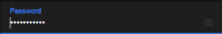
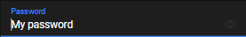

# ngx-show-hide-password

## About

A container element that adds a hide/show eye to the input ou ion-input inside





## Instalation

```bash
 npm i ngx-show-hide-password --save
```

## Usage

> app.module.ts

```typescript
import { NgxShowHidePasswordModule } from 'ngx-show-hide-password';

@NgModule({
  imports: [
    NgxShowHidePasswordModule
  ]
})
export class AppModule {}
```

> app.component.html

```html
 <ion-item>
    <ion-label position="stacked">Password</ion-label>
    <ngx-show-hide-password>
        <ion-input value="My password" type="password"></ion-input>
    </ngx-show-hide-password>
 </ion-item>
```

`OR`

> app.component.html

```html
 <ngx-show-hide-password>
     <input value="My password" type="password"/>
 </ngx-show-hide-password>
```
